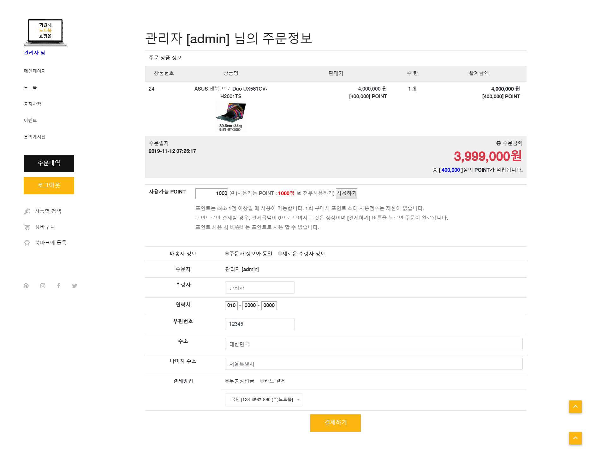

# NoteMall

-----------------
## 1. 목차
```
.NotaMall 노트북 전자상거래 사이트
├── 1.목차
├── 2.URL
├── 3.개요
├── 4.특징
├── 5.사용법
|   ├── 5.1.개발 환경 & 개발 툴
|   └── 5.2.실행 방법
|       ├── 5.2.1 실행 환경 세팅
|       └── 5.2.2 실행
└── 6.스크린샷
    ├── 6.1.메인 화면
    ├── 6.2.레이어 팝업 화면
    ├── 6.3.상품목록 화면
    ├── 6.4.상품정보 화면
    ├── 6.5.주문과정 화면
    ├── 6.6.주문정보 화면
    ├── 6.7.관리자 전용 페이지
    ├── 6.8.문의게시판 화면
    └── 6.9.데이터베이스 테이블 화면
```

## 2. URL 
# http://0254.duckdns.org:9090/notemall/


## 3. 개요
 - **Spring Framework**로 구현한 **MVC패턴의 전자상거래 사이트**입니다. 
 - 사이트에는 회원가입과 로그인, 상품목록, 상품정보, 장바구니, 주문,  등의 기능이 구현되어 있습니다.
 - Maven, MyBatis, Log4j, Lombok, 구글 API 등 다양한 라이브러리 및 유틸리티를 활용하였습니다. 
 
 
 
## 4. 특징
- 회원제 쇼핑몰 사이트로 로그인을 해야 상품 주문 및 게시판 서비스를 이용 가능하게 하였습니다.
- 메인페이지에는 레이어 팝업을 적용하여 메인페이지에서 팝업을 띄우게 하였고 쿠키를 생성하여 일정 기간동안 팝업을 띄우지 않을수 있도록 하였습니다.
- 자체 회원가입과 로그인 기능이 구현되어있고, 회원가입시에는 Ajax를 활용하여 ID중복검사가 바로 가능하도록 하였습니다.
- 상품정보 페이지에는 브랜드별로 카테고리와 해당 상품 검색이 가능하도록 구현하였습니다.
- Contact부분에는 구글 맵 API를 이용하여 지도를 띄웠습니다.
- 관리자 페이지를 따로 구현하여 게시글 관리와 매출통계, 주문 목록과 관리를 쉽게 할 수 있도록 했습니다.
- 회원마다 포인트 시스템을 적용하여 결제시 포인트를 사용하거나 상품 구매시 포인트를 적립할 수 있도록 하였습니다.
- 게시판은 문의, 답변 게시판으로 사용자가 문의글을 남기면 관리자가 해당 글을 확인하고 답변글을 남기는 형식으로 제작하였고 파일을 첨부할 수 있도록 했습니다.
- 반응형 웹페이지로 PC와 MOBILE등 각 기기에 맞도록 최적화된 화면을 보여줍니다.
- aws로 구동하며 도메인을 이용하여 어디에서나 http://0254.duckdns.org:9090/notemall/ 를 입력하면 접속이 가능하도록 하였습니다.


## 5. 사용법
### 5.1. 개발 환경 & 개발 툴
- Programing Language : HTML, CSS, JavaScript, jQuery, Java 8, JSP, Servlet
- Framework : Bootstrap, Spring 5.0.7, MyBatis
- Database : Oracle Database 11g Express
- API : Google Maps JavaScript API
- Server : Apache Tomcat 8.5
- OS: Windows 10 
-----------------------------------------------------------------------------
- Tool : Spring Tool Suite, VS code
- DB Modeling Tool : Exerd
- Graphic Tool : Adobe Photoshop CC


### 5.2. 실행 방법
#### 5.2.1 실행환경 세팅
```
# 1. Spring Tool Suite에 해당 NoteMall프로젝트를 import 합니다.
- ojdbc6.jar 파일이 lib 폴더에 포함되어 있습니다. 
# 2. src/main/resources/DDL 폴더에 있는 SQL 파일로 테이블을 만드시기 바랍니다. 
- 총 9개의 테이블과 1개의 뷰테이블이 있습니다.
# 3. JNDI설정을 확인하여 DB Connection 여부를 확인하시기 바랍니다.
- jndiDataSource를 참조하지 않으신다면 dataSource bean을 해당 컴퓨터의 설정에 맞게 수정하여 sqlSessionFactoryBean의 property를 jndiDataSource에서 dataSource로 수정하시기 바랍니다.
# 4. 이렇게 하면 세팅은 완료됩니다.
```
#### 5.2.2 실행
```
# 1. 설정이 완료되면 server를 시작하고, 웹 사이트 주소 창에 http://localhost:8080/notemall를 입력하시면 됩니다. 
- 포트 번호(8080)는 본인의 컴퓨터에 설정된 톰캣의 포트번호로 변경해주시기 바랍니다. 
# 2. 회원가입을 해야 원활한 사이트 이용이 가능합니다.
# 3. 회원상태가 관리자일 경우에는 하단의 Admin 페이지를 이용할 수 있습니다.
```


## 6. 스크린샷

### 6.1.메인 화면
 
 -------------

### 6.2. 레이어 팝업 화면
 
 -------------
 
 ### 6.3. 상품목록 화면
 
 -------------
  
 ### 6.4. 상품정보 화면
 
 -------------
  
 ### 6.5. 주문과정 화면
 
 -------------
  
 ### 6.6. 주문정보 화면
 
 -------------
  
 ### 6.7. 관리자 전용 페이지
 
 -------------
 
 -------------
 
 -------------
  
 ### 6.8. 문의게시판 화면
 
 -------------
 
 ### 6.9. 데이터베이스 테이블 화면
 
 -------------

-----------------------------------------------------------------------------
# 감사합니다!
